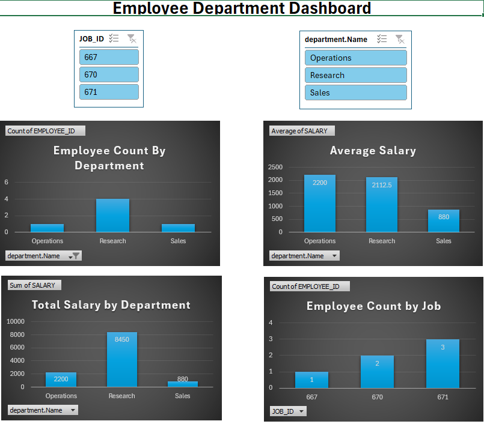
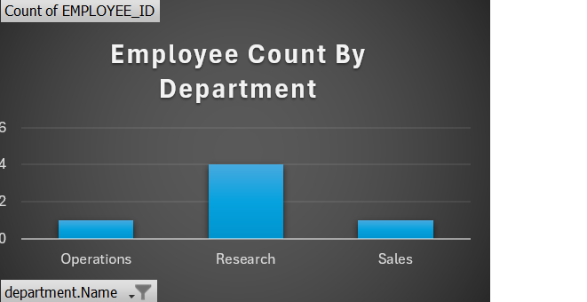
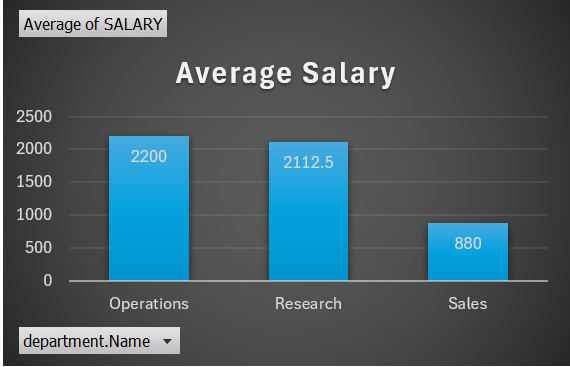
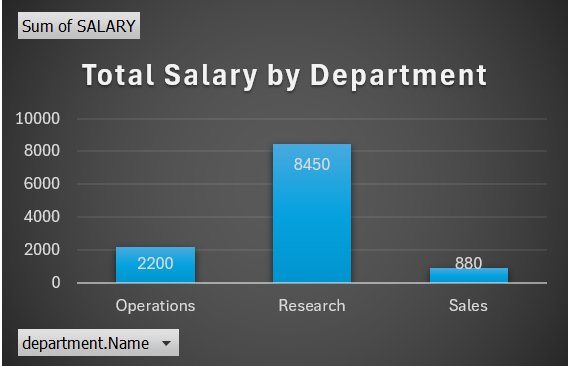
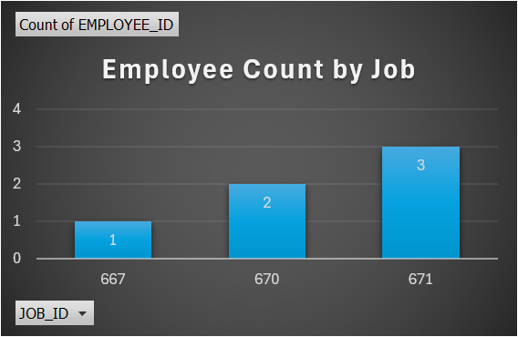

## Employee Department Analysis | SQL Case Study & Interactive Excel Dashboard

## Project Overview

This Project is an end-to-end SQLcase study based on an Employee Management database. The objective was to analyze employee, department, job, and location data using SQL and present business insights through an interactive Excel Dashboard.

## Problem Statement

 Organizations need quick insights into employee distribution, salary trends, department performance, and job-wise workforce allocation. This project solves real business questions using SQL and visualizes the results with an interactive Excel Dashboard.

## Dataset Information

 This project uses 4 Relational Tables
 * Employee
 * Department
 * Job
 * Location
The tables are connected using SQL joins to perform business analysis.

## Tools Used

* MySQL
* SQL
* Microsoft Excel
* Pivot Tables
* Pivot Charts
* Slicers

## SQL Concepts Used

*SELECT
* WHERE
* ORDER BY
* GROUP BY
* HAVING
* INNER JOIN
* LEFT JOIN
* AGGREGATE FUNCTIONS

## 📁 Business Question Solved

 The Project answers 52 Business Questions, including
 * Employee Count By Department
 * Average Salary By Department
 * Total Salary By Department
 * Employee Count By Job
 * Department-wise Employee distribution
 * Salary Comparison across Departments
 * Job-Wise Employee Analysis
 * Department and Location Relationship
 * Employee Hiring Information
 * Additional SQL analytical Queries.

 ## Interactive Dashboard

 
 

 ## Employee Count By Department

   
 

 
 ## Average Salary By Department


  


  
 ## Total Salary By Department


  

  
 ## Employee Count By Job


 

 

Interactive Filters

* Department Name Slicer
* Job ID Slicer

 ## 📊 Key Insights 

* Research Department has the hightest Employee Count.
* Research Department has the hightest Total Salary.
* Sales Department has the Lowest Average Salary.
* Dashboard Updates Dynamically using Slicers.

## Project Structure

```
 employee-department-SQL-excel-dashboard/
|—README.md
|—employee_department_queries.sql
|—
employee_department_dashboard.xlsx
|—dashboard.png
|—charts/
|—dataset/
|—screenshots/

```

## Author

## Pinky
Aspiring Data Analyst | SQL | Excel | Power BI | Python


  


